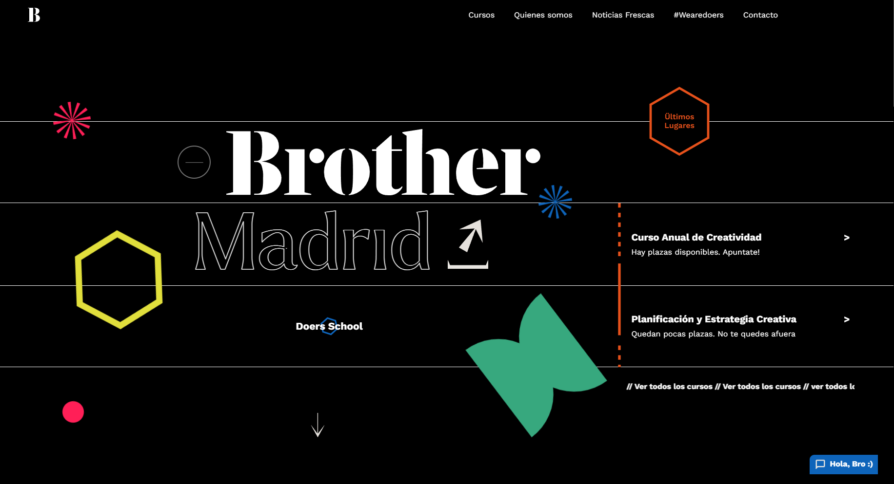

This is a [Next.js](https://nextjs.org/) project bootstrapped with [`create-next-app`](https://github.com/vercel/next.js/tree/canary/packages/create-next-app).

## Getting Started

First, clone the repositorie using git-clone
Then, open a console in the folder repositorie in your computer and excecute

```bash
npm i
```

Then, run the development server:

```bash
npm run dev
# or
yarn dev
# or
pnpm dev
```

Open [http://localhost:3000](http://localhost:3000) with your browser to see the result.


## In this Project

This project uses [`next/font`](https://nextjs.org/docs/basic-features/font-optimization) to automatically optimize and load Inter, a custom Google Font.

And the following packages:

- SASS [https://create-react-app.dev/docs/adding-a-sass-stylesheet/]
- Lenis [https://github.com/studio-freight/lenis]
- Lenis React [https://github.com/studio-freight/react-lenis]
- Slick [https://www.npmjs.com/package/react-slick]
- Plock [https://github.com/itsrennyman/react-plock]
- React fast marquee [https://www.npmjs.com/package/react-fast-marquee]

___________________________________________________________

## Learn More

To learn more about Next.js, take a look at the following resources:

- [Next.js Documentation](https://nextjs.org/docs) - learn about Next.js features and API.
- [Learn Next.js](https://nextjs.org/learn) - an interactive Next.js tutorial.

You can check out [the Next.js GitHub repository](https://github.com/vercel/next.js/) - your feedback and contributions are welcome!

## Deploy on Vercel

The easiest way to deploy your Next.js app is to use the [Vercel Platform](https://vercel.com/new?utm_medium=default-template&filter=next.js&utm_source=create-next-app&utm_campaign=create-next-app-readme) from the creators of Next.js.

Check out our [Next.js deployment documentation](https://nextjs.org/docs/deployment) for more details.
